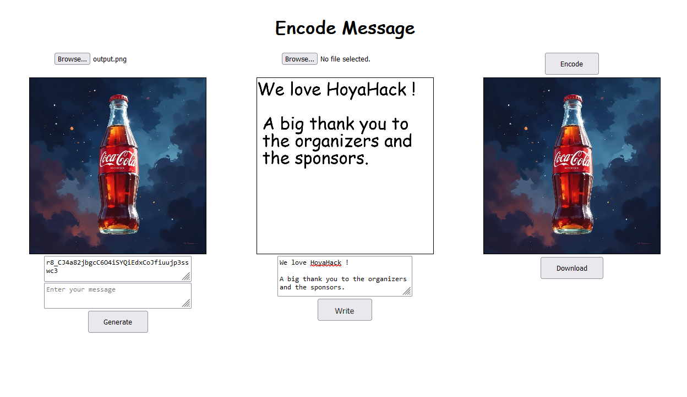
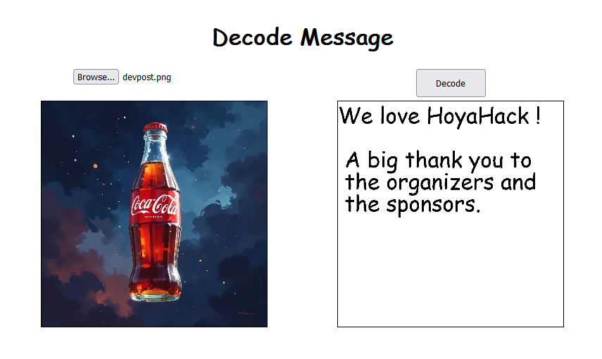
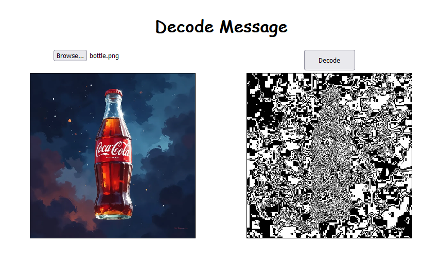

# HoyaHack

- Encoding tool: https://cocoshih.github.io/DC-Paris/encode
- Decoding tool: https://cocoshih.github.io/DC-Paris/decode

Ecoding message in an image:

Decoding a message from an image:

Decoding if the image contains no message:

